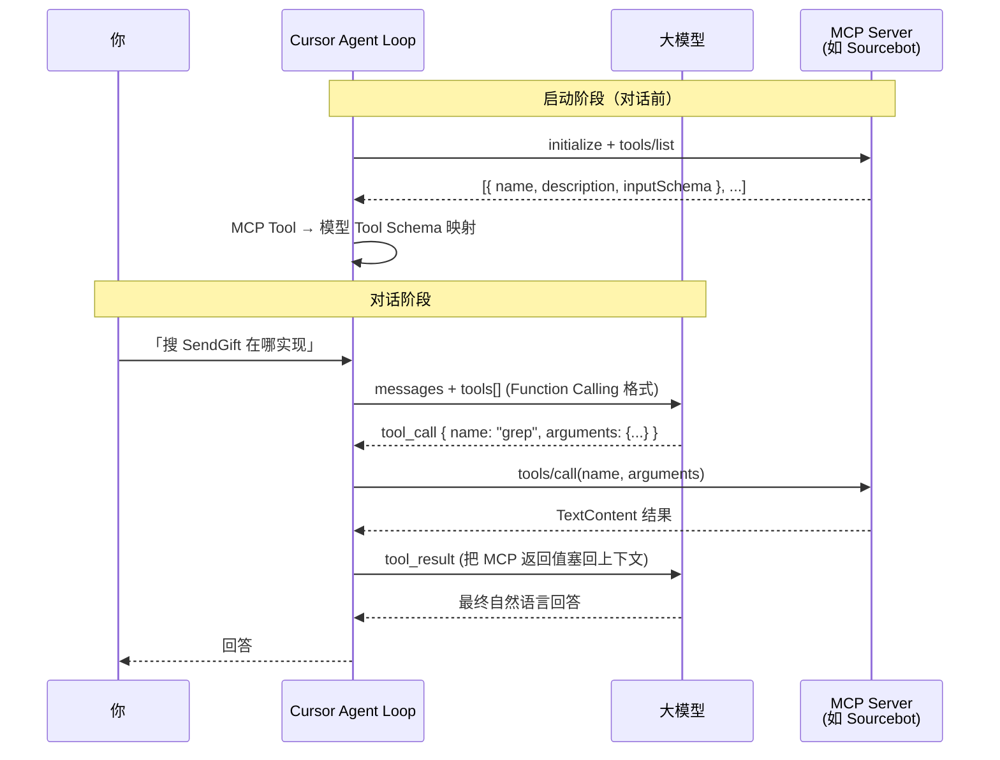
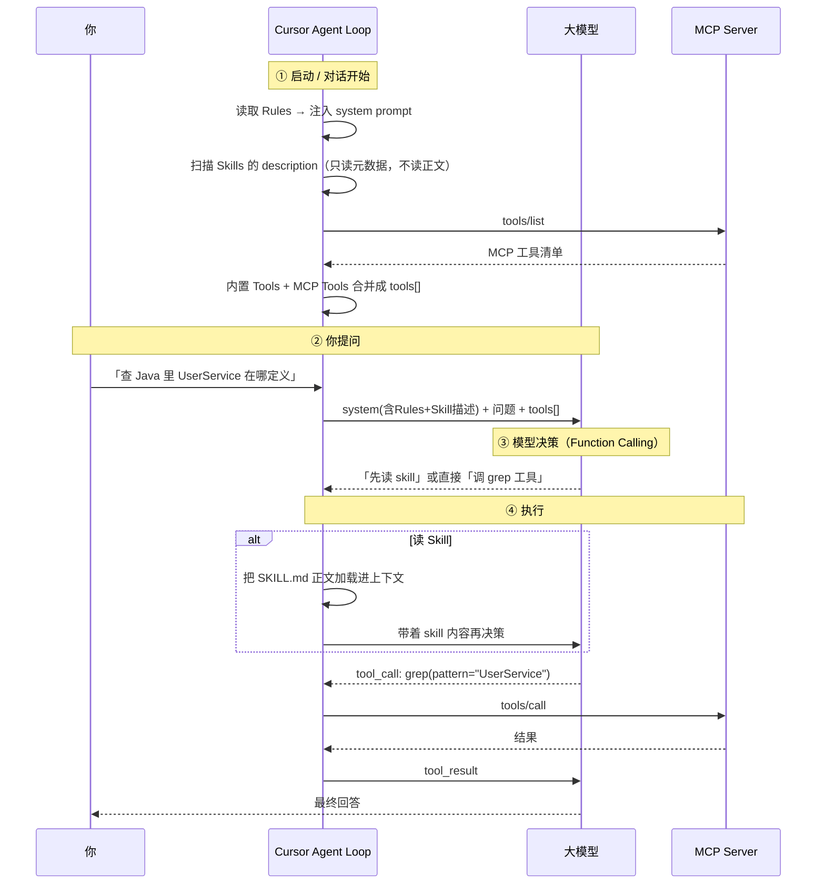

### 1. Cursor 如何把 MCP 转成 Function Calling
Cursor 内部是 两层架构：MCP Client（工具连接层）+ Agent Loop（模型调度层）。
Function Calling 只发生在第二层；MCP 本身不涉及 Function Calling。


#### 分步骤说明
##### ① 连接与发现（MCP 层）
Cursor 读取 mcp.json，按 transport 连接 Server：

| 类型   | 方式 |
|------| --- |
| stdio | 启动子进程，stdin/stdout 走 JSON-RPC |
| HTTP/SSE     | 连远程 URL |
连接成功后发 MCP 标准请求 tools/list，拿到工具清单。

##### ② Schema 映射（Cursor 内部适配层）
Cursor 把每个 MCP Tool 映射成当前模型 API 要求的 Function Calling / Tool Use 格式。结构几乎一一对应：

| MCP (tools/list)   | OpenAI Tools API | Anthropic Messages API | 
|------| --- |------------------------|
| name | function.name | name                   |
| description     | function.description |description|
| inputSchema     | function.parameters |input_schema|
映射后，MCP 工具与 Cursor 内置工具（Read、Grep、Shell 等）合并进同一个 tools[] 数组，一起发给模型。模型看不到「这是 MCP 还是内置」——它只看到统一的 tool 定义。

##### ③ 模型决策（Function Calling 生效处）
用户发消息后，Cursor 把 messages + tools[] 发给模型 API。模型返回结构化 tool call，例如：
```json
{
  "name": "grep",
  "arguments": {
    "pattern": "userService",
    "groupByRepo": true
  }
}
```
这就是 Function Calling 真正生效的地方——在 Cursor ↔ 模型 之间，不在 MCP Server 里。

##### ④ 路由执行（Cursor Agent Loop）

Cursor 收到 tool call 后做路由：
```text
tool_call.name 是内置工具？  → 本地执行（读文件、跑 shell…）
tool_call.name 是 MCP 工具？  → 发 MCP tools/call 给对应 Server
```
对 MCP 工具，Cursor 把模型的 arguments 原样转发给 MCP Server，等 call_tool handler 返回 TextContent / ImageContent 等。

##### ⑤ 结果回灌 + 循环

MCP 返回结果后，Cursor 转成模型的 tool_result 消息格式，再次调用模型。若模型还要调更多工具，循环继续；否则生成最终回答。

##### ⑥ 审批与安全层（Cursor 特有，在 Function Calling 之后）

默认情况下，Cursor 在 执行 tool call 之前 可能弹出确认（Run Mode / Auto-review）。这是 Cursor Agent 的安全层，发生在「模型已决定调什么」之后、「MCP Server 真正执行」之前。


### 2. mcp server, skill, rule, tools 都配置在的 cursor 中是如何工作的

#### 生效时机
它们生效的层次和时机完全不同

| 组件   |本质|何时加载|是否消耗模型「决策」|
|------|---|---|---|
| Rule |持久化的指令文本|对话开始 / 匹配文件时自动注入 system prompt|否，是背景约束|
| Skill |按需加载的工作流知识（SKILL.md）|模型判断相关时才读取正文|是，模型主动决定「要不要读」|
| Tool（内置）     |Cursor 自带能力（Read/Grep/Shell…）|启动即在 tools[] 里|是，模型通过 Function Calling 调用|
| MCP Server  |外部工具提供者|启动时 tools/list，工具并入 tools[]|是，同上，只是执行时转发给外部进程|

关键区别：

Rule 是「你必须遵守的规矩」 → 一直在上下文里，不用调用
Skill 是「一本需要时才翻的手册」 → 模型看描述决定翻不翻
Tool / MCP 是「可以动手做事的手」 → 模型通过 Function Calling 真正调用


#### 加载与调用的完整流程



#### 分步拆解
##### ① 对话开始前（自动，无需模型决策）
* Rules 注入：全局 rule 和匹配当前文件的 rule 直接写进 system prompt。模型「天生」就知道这些约束。 
* Skills 只登记描述：Cursor 把每个 SKILL.md 的 name + description 放进上下文，但不加载正文（省 token）。就像给模型一份「手册目录」。 
* Tools 注册：内置工具 + 所有已启用 MCP Server 的 tools/list 结果，合并成统一的 tools[] 发给模型。
##### ② 你提问
* Cursor 把「system prompt（含 Rules + Skill 目录）+ 你的问题 + tools[]」一起发给模型。

##### ③ 模型决策
模型看到问题后可能做三件事之一（或组合）：

1. 直接回答（不需要工具） 
2. 决定读某个 Skill（发现描述匹配）→ Cursor 加载该 SKILL.md 正文 
3. 调用某个 Tool / MCP 工具（Function Calling）

##### ④ 执行与循环
* 读 Skill → 正文进上下文 → 模型带着新知识再决策 
* 调工具 → Cursor 路由（内置本地执行 / MCP 转发给外部进程）→ 结果回灌 → 继续循环 
* 直到模型产出最终回答


